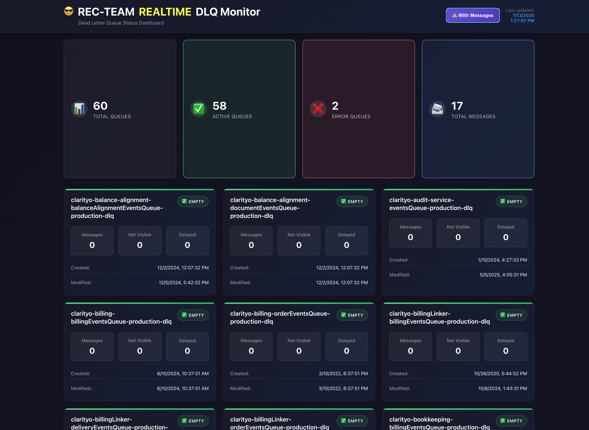
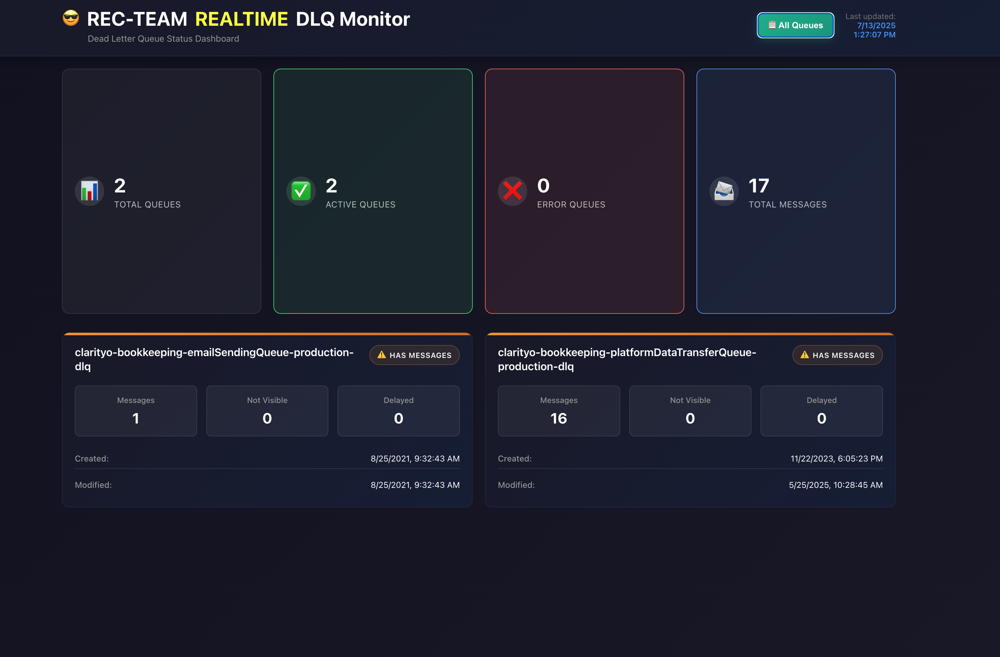

# AWS DLQ <font color="yellow">REALTIME</font> Monitor 🚀

A comprehensive monitoring solution for AWS Dead Letter Queues (DLQs) with real-time dashboard and automated scanning capabilities.



## 📋 Table of Contents

- [Overview](#overview)
- [Features](#features)
- [Architecture](#architecture)
- [Quick Start](#quick-start)
- [Configuration](#configuration)
- [Usage Examples](#usage-examples)
- [Screenshots](#screenshots)
- [API Reference](#api-reference)
- [Contributing](#contributing)
- [License](#license)

## 🎯 Overview

AWS DLQ Monitor is a full-stack monitoring solution that helps you keep track of your AWS Dead Letter Queues in real-time. It consists of:

- **Scanner Service**: Node.js application that monitors DLQ statuses
- **Dashboard**: React-based web interface for real-time visualization
- **Firebase Integration**: Real-time data storage and synchronization

## ✨ Features

- 🔍 **Real-time Monitoring**: Continuous monitoring of DLQ message counts and status
- 📊 **Live Dashboard**: Beautiful React interface with real-time updates
- 🔔 **Alert System**: Visual indicators for queues with messages
- 📱 **Responsive Design**: Works on desktop and mobile devices
- 🔄 **Auto-refresh**: Automatic data updates from Firebase
- 🎯 **Filtering**: Show only queues with messages
- 📈 **Statistics**: Comprehensive metrics and reporting

## 🏗️ Architecture

```
┌─────────────────┐    ┌─────────────────┐    ┌─────────────────┐
│   AWS SQS DLQs  │    │  Scanner Node.js│    │  Firebase RTDB  │
│                 │◄──►│                 │───►│                 │
└─────────────────┘    └─────────────────┘    └─────────────────┘
                                                            │
                                                            ▼
                                                  ┌─────────────────┐
                                                  │ React Dashboard │
                                                  │                 │
                                                  └─────────────────┘
```
## 🪜 Monorepo structure 

```bash
aws-dlq-monitor@1.0.0 /Users/nudelx/dev/aws-dlq-monitor
├── @aws-dlq-monitor/config@1.0.0 -> ./config
├─┬ @aws-dlq-monitor/dashboard@1.0.0 -> ./dashboard
│ ├── @types/react-dom@18.3.7
│ ├── @types/react@18.3.23
│ ├── @vitejs/plugin-react@4.6.0
│ ├── concurrently@8.2.2
│ ├── cors@2.8.5
│ ├── express@5.1.0
│ ├── firebase@11.10.0
│ ├── gh-pages@6.3.0
│ ├── prettier@3.6.2
│ ├── react-dom@18.3.1
│ ├── react@18.3.1
│ └── vite@5.4.19
├─┬ @aws-dlq-monitor/scanner@1.0.0 -> ./scanner
│ ├── @aws-sdk/client-sqs@3.844.0
│ ├── dotenv@16.6.1
│ ├── firebase@10.14.1
│ └── prettier@3.6.2
└── yarn_npm_ls@2.0.0
```
use `npm run ls ` to see the options 

## 🚀 Quick Start

### Prerequisites

- Node.js 20+ 
- AWS CLI configured with appropriate permissions
- Firebase project with Realtime Database

### Installation

1. **Clone the repository**
   ```bash
   git clone https://github.com/your-username/aws-dlq-monitor.git
   cd aws-dlq-monitor
   ```

2. **Install dependencies**
   ```bash
   npm install
   ```

3. **Configure environment variables**
   ```bash
   # Create .env file in scanner directory
   cp scanner/.env.example scanner/.env
   ```

4. **OR Set up Firebase configuration**
   ```bash
   # Add your Firebase config to config/firebase-config.js
   ```
### Running the Application

1. **Start the scanner service**
   ```bash
   npm run scanner:start
   ```

2. **Start the dashboard**
   ```bash
   npm run dashboard:start
   ```

3. **Access the dashboard**
   Open your browser and navigate to `http://localhost:5173`

## ⚙️ Configuration

### DLQ Names Configuration

Edit `config/dlq-names.js` to specify which DLQs to monitor:

```javascript
export const dlqNames = [
  "my-app-dlq",
  "order-processing-dlq", 
  "notification-dlq",
  "payment-dlq"
]
```

### Environment Variables

Create a `.env` file in the `scanner` directory or you can use directly your `~/.aws/credentials` by providing profile name:

```bash
# AWS Configuration
AWS_REGION=eu-west-1
AWS_ACCESS_KEY_ID=your-access-key
AWS_SECRET_ACCESS_KEY=your-secret-key

# Firebase Configuration (optional if using profile)
FIREBASE_PROJECT_ID=your-project-id
```

### Firebase Setup

1. Create a Firebase project
2. Enable Realtime Database
3. Update `config/firebase-config.js`:

```javascript
export const firebaseConfig = {
  apiKey: "your-api-key",
  authDomain: "your-project.firebaseapp.com",
  databaseURL: "https://your-project-default-rtdb.firebaseio.com",
  projectId: "your-project-id",
  storageBucket: "your-project.appspot.com",
  messagingSenderId: "123456789",
  appId: "your-app-id"
}
```

## 📖 Usage Examples

### Basic Monitoring

Start monitoring all configured DLQs:

```bash
npm run scanner:start
```

Output:
```
🔍 Monitoring AWS Dead Letter Queues...

📋 Checking DLQ: my-app-dlq
✅ my-app-dlq: 5 messages
   - Not visible: 0
   - Delayed: 0
   - Created: 2024-01-15T10:30:00.000Z
   - Modified: 2024-01-15T10:30:00.000Z

📊 DLQ Status Report
====================

✅ Active Queues: 3
❌ Error/Not Found: 1

Active DLQs:
  - my-app-dlq: 5 messages ⚠️  HAS MESSAGES
  - order-processing-dlq: 0 messages ✅ EMPTY
  - notification-dlq: 0 messages ✅ EMPTY
```

### Dashboard Features

The dashboard provides several key features:

1. **Real-time Updates**: Data automatically refreshes from Firebase
2. **Message Filtering**: Toggle to show only queues with messages
3. **Statistics Panel**: Overview of active queues, errors, and total messages
4. **Individual Queue Cards**: Detailed information for each DLQ

### Custom Monitoring Script

Create a custom monitoring script:

```javascript
import { monitorAllDLQs } from './scanner/dlq-monitor.js'

const customDLQs = ['custom-dlq-1', 'custom-dlq-2']

async function customMonitor() {
  const sqsClient = createSQSClient()
  const results = await monitorAllDLQs(sqsClient, customDLQs)
  
  // Process results
  results.forEach(queue => {
    if (queue.status === 'ACTIVE') {
      console.log(`${queue.queueName}: ${queue.attributes.approximateNumberOfMessages} messages`)
    }
  })
}
```

## 📸 Screenshots

### Dashboard Overview


The main dashboard shows:
- Statistics panel with key metrics
- Individual DLQ cards with message counts
- Real-time status indicators
- Filter toggle for queues with messages

### Detailed Queue View


Each queue card displays:
- Queue name and status
- Message count with visual indicators
- Creation and modification timestamps
- Queue ARN and URL

## 🔧 API Reference

### Scanner Service

The scanner service provides the following main functions:

#### `monitorAllDLQs(sqsClient, dlqNames)`
Monitors multiple DLQs and returns their status.

**Parameters:**
- `sqsClient`: AWS SQS client instance
- `dlqNames`: Array of DLQ names to monitor

**Returns:** Array of queue status objects

#### `getDLQStatus(sqsClient, queueName)`
Gets the status of a single DLQ.

**Parameters:**
- `sqsClient`: AWS SQS client instance  
- `queueName`: Name of the DLQ to check

**Returns:** Queue status object

### Queue Status Object

```javascript
{
  queueName: "my-dlq",
  status: "ACTIVE" | "NOT_FOUND" | "ERROR",
  queueUrl: "https://sqs.region.amazonaws.com/account/queue",
  attributes: {
    approximateNumberOfMessages: "5",
    approximateNumberOfMessagesNotVisible: "0", 
    approximateNumberOfMessagesDelayed: "0",
    createdTimestamp: "2024-01-15T10:30:00.000Z",
    lastModifiedTimestamp: "2024-01-15T10:30:00.000Z",
    queueArn: "arn:aws:sqs:region:account:queue"
  }
}
```

## 🛠️ Development

### Project Structure

```
aws-dlq-monitor/
├── scanner/                 # Node.js monitoring service
│   ├── dlq-monitor.js      # Main monitoring logic
│   └── package.json
├── dashboard/              # React dashboard application
│   ├── src/
│   │   ├── components/     # React components
│   │   └── App.jsx        # Main dashboard app
│   └── package.json
├── config/                 # Shared configuration
│   ├── dlq-names.js       # DLQ names configuration
│   └── firebase-config.js # Firebase configuration
└── img/                   # Screenshots and images
```

### Available Scripts

```bash
# Start scanner service
npm run scanner:start

# Start dashboard development server
npm run dashboard:start

# Build dashboard for production
npm run dashboard:build

# Format code
npm run format
```

### Adding New Features

1. **New DLQ Types**: Add to `config/dlq-names.js`
2. **Dashboard Components**: Create in `dashboard/src/components/`
3. **Scanner Logic**: Extend `scanner/dlq-monitor.js`

## 🤝 Contributing

1. Fork the repository
2. Create a feature branch (`git checkout -b feature/amazing-feature`)
3. Commit your changes (`git commit -m 'Add amazing feature'`)
4. Push to the branch (`git push origin feature/amazing-feature`)
5. Open a Pull Request

### Development Guidelines

- Follow the existing code style
- Add tests for new features
- Update documentation for API changes
- Ensure Firebase integration works correctly

## 📄 License

This project is licensed under the ISC License - see the [LICENSE](LICENSE) file for details.

## 🙏 Acknowledgments

- AWS SDK for JavaScript v3
- Firebase Realtime Database
- React and Vite for the dashboard
- All contributors and users

---

**Made with ❤️ for AWS developers by Alex Nudelman**

For support and questions, please open an issue on GitHub.
